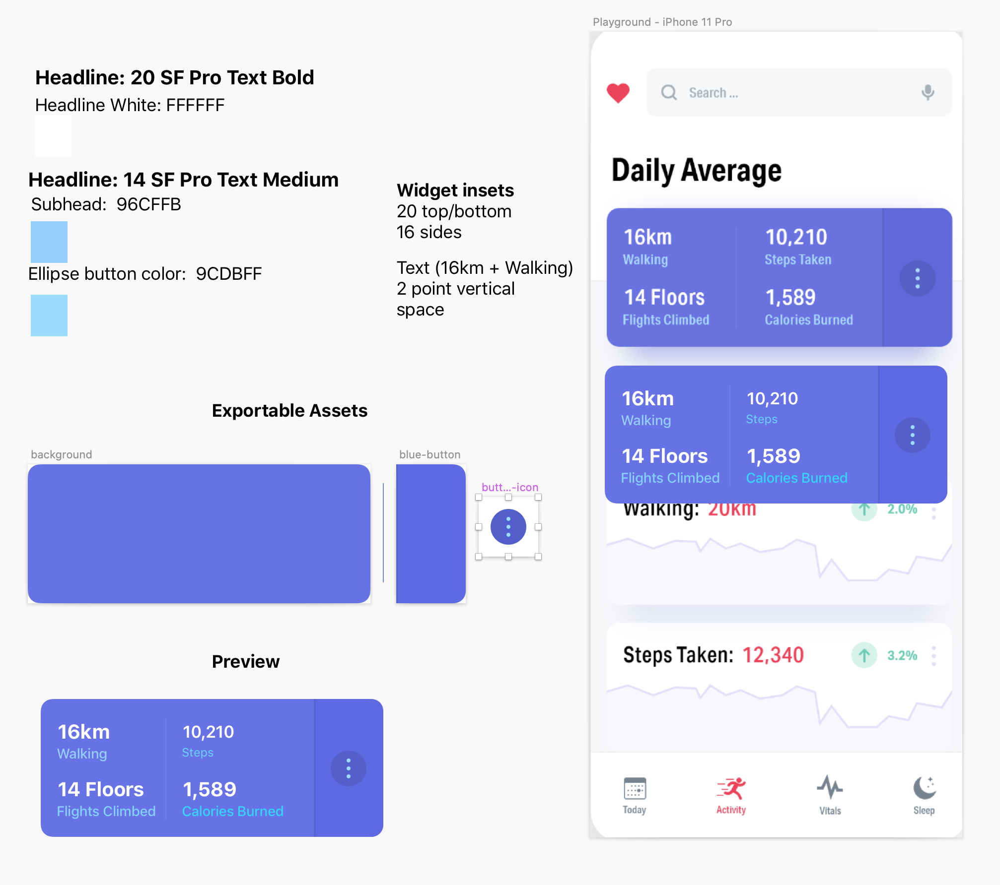
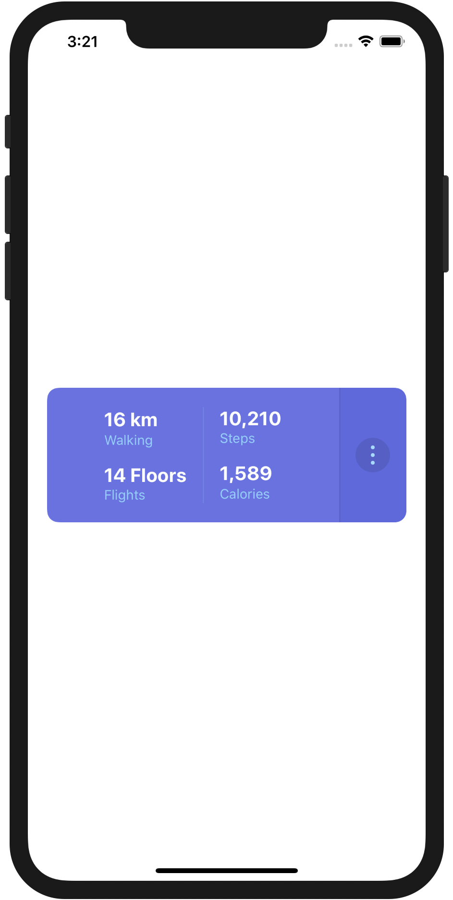

# iOS15 TL Learning Hour - Sketch and Design with Xcode

Started implementing an activity tracker widget based on [Health App by Christian Radu](https://dribbble.com/shots/6629519-Health-App).

## Sketch Design - Health App

It's helpful to have a design you can modify, so if I don't have the original design files, I'll make my own in sketch.

I need to figure out how to inset, fonts, colors, and components I need to make as images, or programmatically. 

* I'll start my design for the iPhone 11 Pro (375 width, 812 height)
* I'm going to use SF Fonts (I explored Heading + Caption 1 for Steps taken, but probably won't use it)
* I'll adjust insets if it's not clear, or they don't match
* I'll tweak in code as I test on different screen sizes
* Auto Layout constraints aren't always clear from a static design, so I may need to change things as I work
* I like to organize items onto Artboards, it's super helpful to give all "icons" a standard size for touch-ability (min 30x30 or 40x40)
* I name things like "blue-button" or "blue-background-separator" for consistency
* I make a section for exportable assets, and I use 1x PDF for vectors
* I slice in for stretchable images in the Asset Catalog

Here's a first design pass on summary widget.

Here's the final result on a Simulator using a Container View (embedded View Controller).

* You can make the content fill better with some additional constraints, but this works for resizing to different screen widths

Add a new comment
